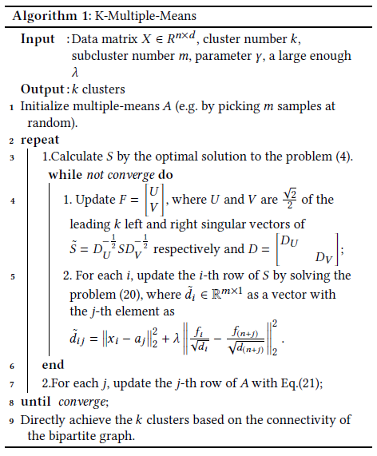

# K-Multiple-Means

Python implementation of k multiple means algorithm

## Algorithm



## Usage

```Python
from kmm import KMMeans

# Initialize K Multiple Means Object
kmm = KMMeans()

# Fit data
kmm.fit(X)

# Get results
y_pred = kmm.labels_
y_prot = kmm.prototype_labels_
A = kmm.prototypes_
S = kmm.conn_proba_
```

**Reference**:

Feiping Nie, Cheng-Long Wang, Xuelong Li, "K-Multiple-Means: A Multiple-Means Clustering Method with Specified K Clusters," in *Proceedings of the 25th ACM SIGKDD International Conference on Knowledge Discovery and Data Mining (KDD'19)*, Anchorage, AK, USA, August 4–8, 2019.
